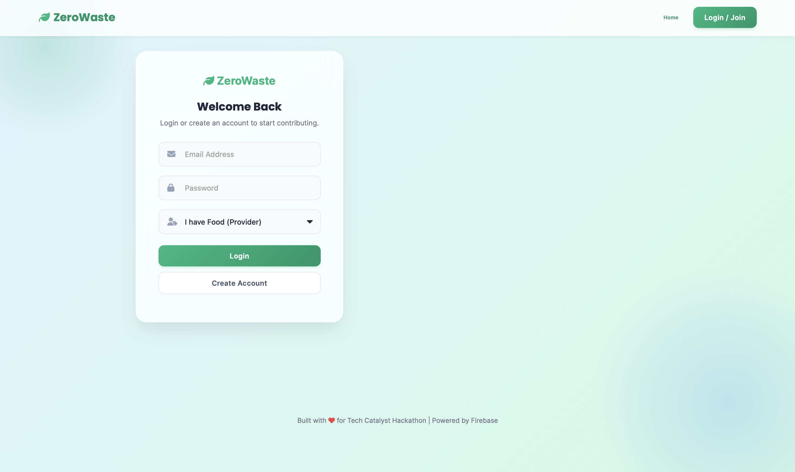
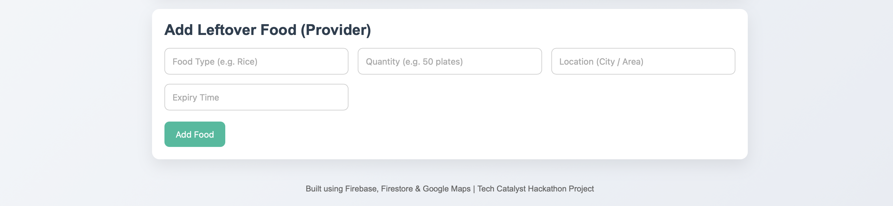
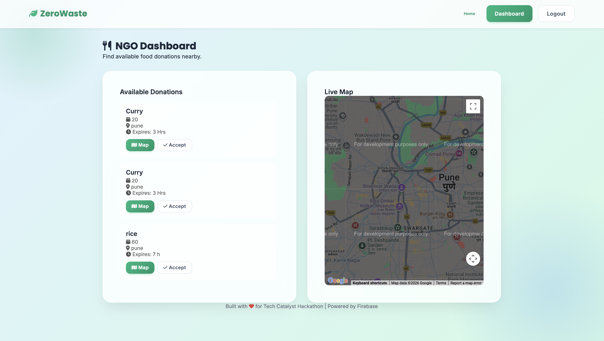

<div align="center">

  <h1>� ZeroWaste</h1>
  <h3>Food Waste to NGO Connector</h3>
  
  <p>
    <b>Turn Waste into Hope.</b> A real-time platform connecting surplus food with local NGOs.
  </p>

  <p>
    <a href="https://foodwastengo.web.app">View Live Demo</a> • 
    <a href="#-key-features">Key Features</a> • 
    <a href="#-tech-stack">Tech Stack</a> • 
    <a href="#-installation">Installation</a>
  </p>

  <!-- 
    TIP: Add a 'banner.png' in the Screenshots folder to make this look even better! 
     
  -->

  <p>
    

  </p>
</div>

---

## 🚨 The Problem

In a world where hunger is a crisis, **food wastage is a tragedy**.
- **40%** of food produced is wasted annually.
- **Millions** go to bed hungry every night.
- Restaurants and events often throw away perfectly edible food due to a **lack of coordination** and **logistics**.

**The Gap:** There is no easy, real-time way for a donor to say "I have food" and an NGO to say "I'm on my way."

---

## 💡 The Solution

**ZeroWaste** bridges this gap instantly. It is a location-based web platform that:
1.  **Connects** Donors (Hotels, Events, Individuals) with NGOs.
2.  **Visualize** donations on a live **Google Map**.
3.  **Facilitates** instant claiming and pickup of food.

> *We don't just reduce waste; we feed communities.*

---

## ✨ Key Features

### 🔐 Secure & Role-Based
- **Authenticated Access**: Secure login via Firebase Auth.
- **Dedicated Dashboards**: Custom interfaces for **Providers** (Donors) and **NGOs**.

### 🧑‍🍳 For Food Providers (Donors)
- **Quick Post**: List surplus food in under 30 seconds.
- **Details**: Specify food type, quantity, location, and expiry time.
- **Impact Tracking**: See how many meals you've saved.

### 🏥 For NGOs (Recipients)
- **Real-Time Feed**: Live visibility of all available donations.
- **Interactive Map**: View donation pick-up points on Google Maps.
- **Instant Claim**: "Accept" button to reserve food and notify the donor.

---

## 🛠️ Tech Stack

This project is built with a focus on **speed**, **scalability**, and **user experience**.

| Component | Technology | Why? |
|-----------|------------|------|
| **Frontend** |    | Lightweight, fast, and responsive. |
| **Auth** |  | Secure and seamless user management. |
| **Database** |  | Real-time NoSQL database for instant updates. |
| **Hosting** |  | Fast, secure, global content delivery. |
| **Maps** |  | Essential for logistics and route planning. |

---

## 📸 Screenshots

| Homepage | Login Interface |
|:---:|:---:|
|  |  |

| Provider Dashboard | NGO Dashboard & Map |
|:---:|:---:|
|  |  |

---

## 🚀 Installation & Setup

Want to run this locally? Follow these steps:

1.  **Clone the Repo**
    ```bash
    git clone https://github.com/ghorpadeonkar01/food-waste-ngo.git
    cd food-waste-ngo
    ```

2.  **Add Firebase Config**
    - Create a file `firebase-config.js` or update `app.js` with your credentials.
    - Ensure Firestore and Auth are enabled in your Firebase Console.

3.  **Run Locally**
    - You can use standard `Live Server` or:
    ```bash
    firebase serve
    ```

4.  **Deploy**
    ```bash
    firebase deploy
    ```

---

## 🎯 Impact & Future Scope

This project is more than code; it's a movement.
- **Scalability**: Can be expanded to include volunteer drivers.
- **AI Integration**: Predict food waste hotspots using historical data.
- **Gamification**: badges and leaderboards for top donors.

---

<div align="center">
  <h3>🏆 Built for Tech Catalyst Hackathon 🏆</h3>
  <p>
    Developed with ❤️ by <b>Onkar Ghorpade|FE(IT)SCOE,PUNE|</b>
  </p>
  <p>
    <a href="https://github.com/ghorpadeonkar01">GitHub Profile</a>
  </p>
</div>
